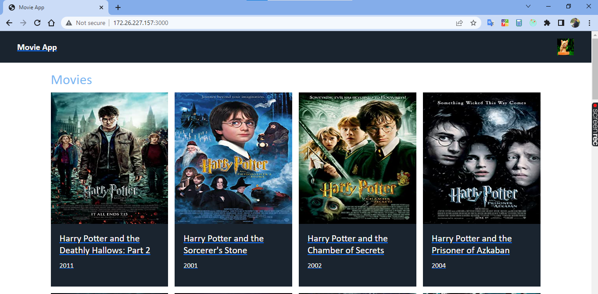
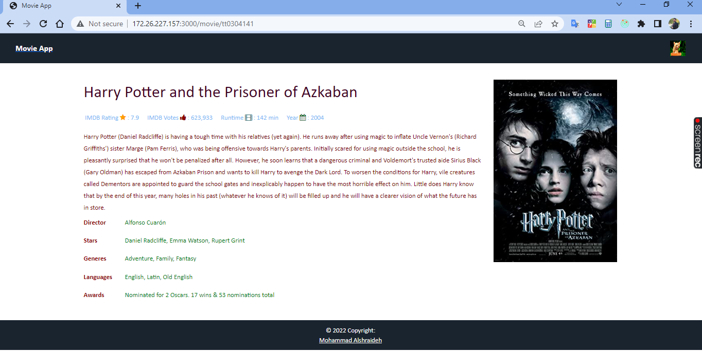

# Movie App

### react Application fetch data from IMDB Movies API

### dependencies :
most important :
"react": "^17.0.0",

"axios": "^0.27.2",

@reduxjs/toolkit": "^1.8.5",

"react-router-dom": "^5.0.2",

"node-sass": "^7.0.1",

